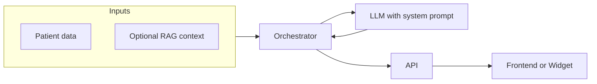

# AI Agent: Why and How

This document explains why the app needs the AI agent and how the team wants it to work. It is derived from [project_context.md](project_context.md), [initial_thoughts.md](initial_thoughts.md), [technologies_overview.md](technologies_overview.md), [data_model.md](data_model.md), and the project `.cursorrules`.

---

## Why we need the AI agent

### Product purpose

The app is an **AI Medical Agent** — a medical assistant that turns stored patient data into **daily, personalized improvement recommendations**. Without the agent, the app would only store and display data; the agent is what delivers the core value: nutrition, lifestyle, exercise, and non-critical alerts.

### Data already in place

The backend and data model (Users, UserVitals, UserMedications, UserExams) are built to feed the agent:

- Demographics (age, weight, height)
- Vitals over time (heart rate, blood pressure, sleep, stress, etc.)
- Medications and dietary preferences
- (Future) PDF-derived context from medical reports and prescriptions

The agent is the **interpretation layer** that uses this data to produce actionable suggestions.

### Differentiation

Whether the app is used as a PWA, mobile app, or widget in an external platform, the differentiator is **personalized, context-aware recommendations**. That requires an AI layer (LLM + optional RAG), not just static rules.

### Context and safety

Vector search and system prompts allow recommendations to be:

- **Grounded** in relevant medical context (e.g. retrieved chunks from PDFs or specialty knowledge)
- **Constrained** by clear rules (e.g. non-critical only, language, limits)

The agent is designed as a dedicated component with explicit rules so behavior is predictable and safe.

---

## How we want the AI agent to work

### Phase and scope

The AI agent is implemented in **Phase 3 (Agente)** per project context:

- System prompts with defined rules (language, context, limits)
- External context injection (specialized areas, possibly client-defined)
- Orchestrator for daily suggestions based on current patient data
- Unit tests for AI agent logic

### Inputs

- **Current patient data:** profile (demographics, objectives, dietary preferences), recent vitals, medications
- **Retrieved context (optional):** chunks from vector search over ingested PDFs or specialty knowledge (e.g. cardiology, nutrition)

### Outputs

Daily suggestions only, for example:

- Nutritional plans
- Exercise plans
- Lifestyle improvements
- **Non-critical health alerts**

Recommendations must be framed as non-critical alerts and improvements — no diagnosis or critical medical advice.

### System prompts

System prompts must define clear **rules, language, context, and limits** (e.g. tone, scope, “non-critical only”) so behavior is predictable and safe.

### External context injection

- Support for **specialized medical areas** (e.g. cardiology, nutrition), possibly client-defined
- Vector search (MongoDB Vector Search or similar) used to retrieve relevant chunks and inject them into the prompt (RAG flow as in [technologies_overview.md](technologies_overview.md))

### Orchestrator pattern

A single **orchestrator** is responsible for **daily recommendation generation**:

1. Gather current patient data (profile, vitals, medications, objectives)
2. Optionally run retrieval (vector search) for PDF or specialty context
3. Call the LLM with: system prompt + retrieved context + patient snapshot
4. Return structured suggestions

The frontend or widget consumes these via an API (e.g. daily summary + recommendations).

### Non-critical only

Recommendations must be **non-critical alerts and improvements** only. Guardrails and prompting enforce this; the agent does not provide diagnosis or critical medical advice.

### Tech

- **LLM:** OpenAI or Google Gemini (provider-agnostic architecture)
- **RAG (when needed):** embeddings + vector search (e.g. MongoDB Vector Search) for PDFs or external knowledge bases
- **Architecture:** Template Method + Strategy patterns for scalable, provider-agnostic LLM layer

> **Implementation details:** See [ai_agent_implementation_plan.md](ai_agent_implementation_plan.md) for the detailed architecture, folder structure, and code patterns.

---

## Flow (high level)

Patient data and optional RAG context feed the orchestrator; the orchestrator calls the LLM (system prompt + context + patient snapshot) and returns daily recommendations via the API to the frontend or widget.
