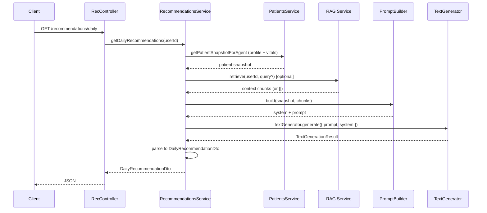

# AI Medical Agent Backend – Implementation Plan

## Overview

Design and implement a dedicated AI Medical Agent layer in the NestJS backend: scalable, provider-agnostic LLM abstraction, daily recommendation service, system prompt builder, optional RAG retrieval hooks, and a recommendations API—with config-driven model selection, strict safety constraints, and no business logic in controllers.

**Phase 1** uses only profile + vitals; `getMedications`/`getExams` are deferred for a later phase.

---

## Current state

- **Patients**: `patients/patients.service.ts` exposes `getProfile`, `getVitals`, `createVital`, `updateProfile`, and `getPatientSnapshotForAgent`.
- **Config**: `.env.example` has `LLM_PROVIDER`, `OPENAI_API_KEY`, `OPENAI_CHAT_MODEL`, etc.
- **Dependencies**: `openai` SDK installed.

---

## 1. Folder and module structure

```
backend/src/
├── llm/                              # Provider-agnostic LLM layer
│   ├── interfaces/
│   │   ├── text.ts                   # TextGenerator, LLM_TEXT_GENERATOR token
│   │   ├── audio.ts                  # AudioTranscriber
│   │   └── images.ts                 # ImageGenerator
│   │
│   ├── providers/
│   │   ├── openai/
│   │   │   ├── client.ts             # createOpenAIClient(apiKey)
│   │   │   ├── config.ts             # OPENAI_MODELS, OPENAI_DEFAULTS
│   │   │   ├── text/ (gpt base, gpt-4o, gpt-4.1-mini)
│   │   │   ├── audio/whisper/
│   │   │   └── openai-llm-service.ts
│   │   └── gemini/
│   │       ├── client.ts
│   │       ├── text/gemini-pro/
│   │       └── gemini-llm-service.ts
│   │
│   ├── prompts/
│   │   ├── prompts.config.ts         # Safety rules, AGENT_ROLE, OUTPUT_FORMAT
│   │   ├── system-prompt.builder.ts  # build(snapshot, ragChunks) → { system, prompt }
│   │   ├── patient-snapshot.formatter.ts  # PatientSnapshotDto → string for LLM
│   │   └── index.ts
│   │
│   ├── llm-service.types.ts          # LLMService interface (text, audio?, images?)
│   ├── llm-provider-factory.ts       # createLLMService({ provider, apiKey, openaiModel })
│   ├── llm.module.ts                 # Provides LLM_TEXT_GENERATOR (TextGenerator)
│   └── index.ts
│
├── rag/
│   ├── rag.module.ts
│   ├── rag.interface.ts
│   ├── rag.service.ts                # Stub (returns [])
│   └── index.ts
│
├── recommendations/
│   ├── dto/
│   │   ├── daily-recommendation.dto.ts   # API response shape for GET /recommendations/daily
│   │   └── index.ts
│   ├── recommendations.module.ts
│   ├── recommendations.controller.ts
│   ├── recommendations.service.ts
│   └── recommendations.service.spec.ts
│
├── patients/
│   ├── dto/
│   │   ├── patient-snapshot.dto.ts   # Output of getPatientSnapshotForAgent (profile + vitals)
│   │   └── ...
│   └── ...
├── common/
│   └── utils/
│       ├── date.utils.ts             # calculateAge, etc.
│       └── index.ts
├── auth/
├── infra/
└── ...
```

**Separation of concerns**

- **llm**: Interfaces (`TextGenerator`), provider implementations under `providers/`, factory, and prompt building. Injects `LLM_TEXT_GENERATOR` (TextGenerator). No DTOs; consumes `PatientSnapshotDto` from patients and formats it for prompts.
- **recommendations**: Controller + RecommendationsService; uses `LLM_TEXT_GENERATOR` (TextGenerator) and returns `DailyRecommendationDto` (own DTO).
- **patients**: Owns `PatientSnapshotDto` and `getPatientSnapshotForAgent()`; business logic transforms DB data into agent snapshot.
- **rag**: Interface + stub; optional context for prompts.

---

## 2. LLM Architecture (Template Method + Strategy)

### 2.1 Provider-agnostic interfaces

```ts
// llm/interfaces/text.ts
interface TextGenerationInput {
  prompt: string;
  system?: string;
  temperature?: number;
  maxTokens?: number;
}

interface TextGenerationResult {
  text: string;
  usage?: { inputTokens: number; outputTokens: number };
}

interface TextGenerator {
  generate(input: TextGenerationInput): Promise<TextGenerationResult>;
}
```

### 2.2 LLMService shape

```ts
// llm/llm-service.types.ts
interface LLMService {
  text: { generator: TextGenerator };
  audio?: { transcriber?: AudioTranscriber };
  images?: { generator?: ImageGenerator };
}
```

### 2.3 OpenAI: Template Method base

```ts
// llm/openai/text/gpt/gpt-text-base-provider.ts
abstract class GPTTextBaseProvider implements TextGenerator {
  protected abstract model: string;
  protected defaultTemperature = 0.7;
  protected defaultMaxTokens = 15000;

  constructor(protected readonly client: OpenAI) {}

  async generate(input: TextGenerationInput): Promise<TextGenerationResult> {
    // Shared: build messages, call client.chat.completions.create, parse result
  }
}
```

### 2.4 OpenAI: Strategy per model

```ts
// llm/openai/text/gpt-4o/generate.ts
class GPT4oTextGenerator extends GPTTextBaseProvider {
  protected model = 'gpt-4o';
  protected defaultTemperature = 0.3;
}
```

### 2.5 OpenAI service assembly (no conditionals)

```ts
// llm/openai/openai-llm-service.ts
function createOpenAILLMService(apiKey: string, modelVariant: 'gpt-4o' | 'gpt-4.1-mini'): LLMService {
  const client = createOpenAIClient(apiKey);
  const generatorByModel = {
    'gpt-4o': new GPT4oTextGenerator(client),
    'gpt-4.1-mini': new GPT41MiniTextGenerator(client),
  };
  return { text: { generator: generatorByModel[modelVariant] } };
}
```

### 2.6 Provider factory

```ts
// llm/llm-provider-factory.ts
function createLLMService(options: { provider: 'openai' | 'gemini'; apiKey: string; openaiModel?: string }): LLMService
```

### 2.7 NestJS wiring

`LlmModule` provides `LLM_TEXT_GENERATOR` (a `TextGenerator`). `RecommendationsService` injects it and calls `textGenerator.generate({ prompt, system, temperature })` directly.

---

## 3. Data flow



---

## 4. Safety and prompts

Safety rules in `prompts.config.ts`:

1. **NO DIAGNOSIS**
2. **NO CRITICAL/EMERGENCY ADVICE**
3. **NO MEDICATION CHANGES**
4. **SUPPORTIVE LANGUAGE**
5. **WELLNESS ONLY**
6. **NON-CRITICAL ALERTS**

`SystemPromptBuilder` injects these rules plus patient context and optional RAG chunks.

---

## 5. Env and config

```env
# LLM Configuration
LLM_PROVIDER=openai

# OpenAI
OPENAI_API_KEY=
OPENAI_CHAT_MODEL=gpt-4o
OPENAI_TEMPERATURE=0.3
OPENAI_MAX_TOKENS=15000

# Gemini (future)
# GEMINI_API_KEY=
# GEMINI_MODEL=gemini-pro
```

---

## 6. Adding a new model

1. Create folder: `llm/providers/openai/text/gpt-5/generate.ts`
2. Extend base: `class GPT5TextGenerator extends GPTTextBaseProvider { protected model = 'gpt-5'; }`
3. Add to config: `OPENAI_MODELS.GPT_5 = 'gpt-5'`
4. Add to assembly: extend `OpenAIModelVariant`, add to `generatorByModel`
5. No changes to `RecommendationsService` or any other consumer

---

## 7. Usage examples

### Standalone (scripts, tests)

```ts
import { createOpenAILLMService } from './llm';

const llm = createOpenAILLMService(process.env.OPENAI_API_KEY!, 'gpt-4o');
const result = await llm.text.generator.generate({
  prompt: 'Explain transformers',
  system: 'You are a teacher.',
});
console.log(result.text);
```

### NestJS (RecommendationsService)

```ts
@Injectable()
export class RecommendationsService {
  constructor(
    @Inject(LLM_TEXT_GENERATOR) private readonly textGenerator: TextGenerator,
    // ...
  ) {}

  async getDailyRecommendations(userId: string) {
    const { system, prompt } = this.promptBuilder.build(snapshot, ragChunks);
    const result = await this.textGenerator.generate({ prompt, system, temperature: 0.3 });
    // ... parse result.text to DailyRecommendationDto ...
  }
}
```

---

## 8. Files summary

| File | Purpose |
|------|---------|
| `llm/interfaces/text.ts` | TextGenerator, LLM_TEXT_GENERATOR token |
| `llm/llm-service.types.ts` | LLMService shape |
| `llm/providers/openai/` | client, config, openai-llm-service, text (gpt base, gpt-4o, gpt-4.1-mini), audio/whisper |
| `llm/providers/gemini/` | client, gemini-llm-service, text/gemini-pro |
| `llm/llm-provider-factory.ts` | createLLMService |
| `llm/llm.module.ts` | NestJS module (provides LLM_TEXT_GENERATOR) |
| `llm/prompts/prompts.config.ts` | Safety rules |
| `llm/prompts/system-prompt.builder.ts` | build(snapshot, ragChunks) → { system, prompt } |
| `llm/prompts/patient-snapshot.formatter.ts` | PatientSnapshotDto → string for LLM context |
| `patients/dto/patient-snapshot.dto.ts` | Snapshot shape (output of getPatientSnapshotForAgent) |
| `recommendations/dto/daily-recommendation.dto.ts` | API response shape for GET /recommendations/daily |
| `common/utils/date.utils.ts` | calculateAge (shared utility) |
| `rag/rag.service.ts` | Stub retrieval |
| `recommendations/recommendations.service.ts` | Business logic |
| `recommendations/recommendations.controller.ts` | API endpoint |

---

## 9. Extensibility (later)

- **More models**: Add folder + Strategy class, extend type, add to assembly record
- **More providers**: Add `llm/providers/<provider>/` with client, text generators, and service
- **More capabilities**: Add audio or images to existing providers
- **Medications/Exams**: Add to `getPatientSnapshotForAgent`
- **More specialties**: RAG namespace or prompt builder rule sets
