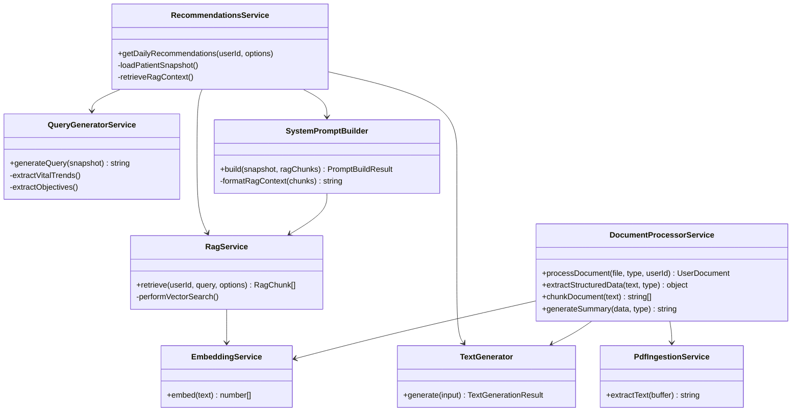
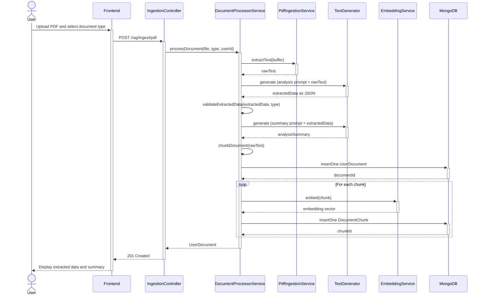
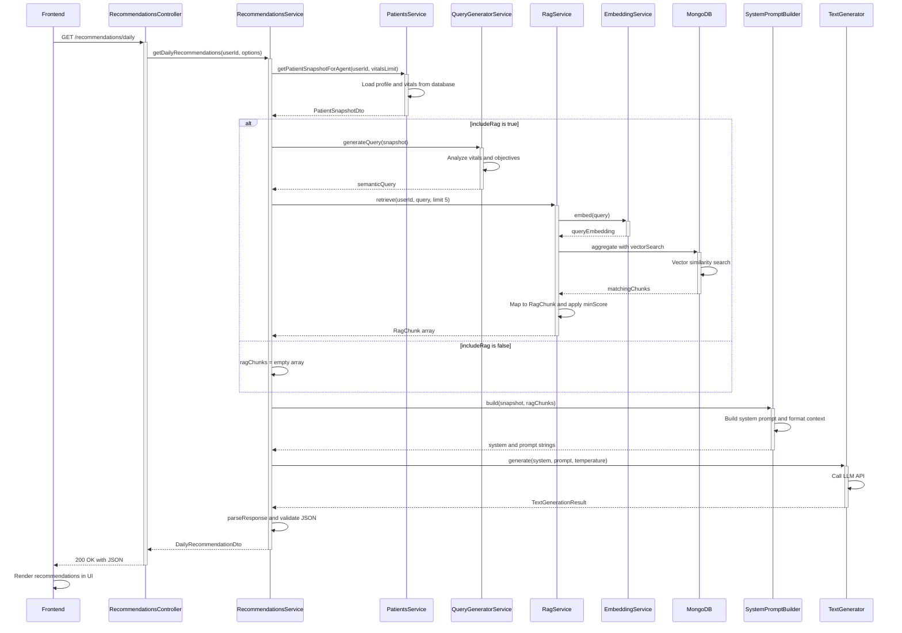
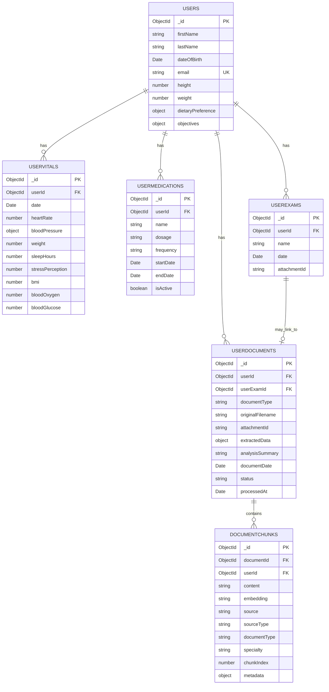

# RAG Vector Search Implementation Plan

## Overview

Enhance the recommendations system by implementing RAG (Retrieval-Augmented Generation) with MongoDB Vector Search. This will allow the AI agent to retrieve relevant medical context from ingested documents (PDFs, medical guidelines, specialty knowledge) and inject it into prompts, resulting in more accurate, evidence-based recommendations.

The system will support two types of document ingestion:
1. **User Medical Documents**: Blood analysis, medical reports, prescriptions uploaded by users
2. **Knowledge Base Documents**: Medical guidelines, specialty knowledge, reference materials

For user documents, the system will:
- Allow users to classify document type
- Extract structured data (lab values, findings, dates)
- Generate embeddings for semantic search
- Store both structured data and chunks for retrieval

## Current State

- **RAG Service**: Stub implementation in `backend/src/rag/rag.service.ts` that returns empty arrays
- **Integration**: Already integrated into `backend/src/recommendations/recommendations.service.ts` - calls `ragService.retrieve()` and passes chunks to prompt builder
- **Prompt Builder**: `backend/src/llm/prompts/system-prompt.builder.ts` already formats RAG chunks into prompts
- **Database**: MongoDB with Mongoose configured in `backend/src/infra/database/database.module.ts`

## Implementation Steps

### 1. Embedding Service

**Location**: `backend/src/rag/embedding/embedding.service.ts`

Create a provider-agnostic embedding service interface and implementation:

- **Interface**: `IEmbeddingService` with `embed(text: string): Promise<number[]>`
- **OpenAI Implementation**: Use `text-embedding-3-small` or `text-embedding-3-large` (OpenAI Embeddings API)
- **Config**: Add `OPENAI_EMBEDDING_MODEL` to `.env.example`
- **Module**: Add to `rag.module.ts` with provider factory pattern (similar to LLM module)

**Benefits**: 
- Converts text queries and document chunks into vectors for similarity search
- Provider-agnostic design allows future Gemini embeddings support

### 2. Document Type Classification

**Location**: `backend/src/rag/types/document-types.ts`

Define supported document types that users can select:

```typescript
export enum DocumentType {
  BLOOD_ANALYSIS = 'blood_analysis',      // Blood test results, lab reports
  MEDICAL_REPORT = 'medical_report',      // Doctor's reports, consultation notes
  PRESCRIPTION = 'prescription',           // Medication prescriptions
  IMAGING_REPORT = 'imaging_report',      // X-ray, MRI, CT scan reports
  VACCINATION_RECORD = 'vaccination_record',
  OTHER = 'other'
}

export interface DocumentTypeMetadata {
  type: DocumentType;
  displayName: string;
  description: string;
  extractionSchema?: object;  // JSON schema for structured data extraction
}
```

**User Selection**: Frontend will present document type selection during upload, allowing users to classify their documents.

### 3. Document Chunks Schema

**Location**: `backend/src/rag/schemas/document-chunk.schema.ts`

Create MongoDB schema for storing document chunks with embeddings:

```typescript
{
  content: string;           // The text chunk
  embedding: number[];       // Vector embedding (1536 dims for OpenAI)
  source: string;            // Document name, URL, or identifier
  sourceType: string;        // 'pdf', 'guideline', 'specialty', 'user-doc'
  documentType?: DocumentType; // For user docs: blood_analysis, medical_report, etc.
  specialty?: string;        // Optional: 'cardiology', 'nutrition', etc.
  userId?: ObjectId;         // Optional: for user-specific documents
  documentId?: ObjectId;     // Reference to UserDocument document
  chunkIndex: number;        // Order of chunk within document
  metadata?: object;         // Additional metadata (page, section, etc.)
  createdAt: Date;
  updatedAt: Date;
}
```

**Collection**: `documentchunks`

**Indexes**:
- Vector index on `embedding` field (MongoDB Atlas Vector Search)
- Regular indexes: `userId`, `sourceType`, `documentType`, `specialty`, `documentId`

### 4. User Document Schema (Structured Data)

**Location**: `backend/src/rag/schemas/user-document.schema.ts`

Create schema for storing structured extracted data from user documents:

```typescript
{
  userId: ObjectId;          // Reference to User
  userExamId?: ObjectId;    // Optional: link to UserExam if uploaded via exam
  documentType: DocumentType; // blood_analysis, medical_report, etc.
  originalFilename: string;
  attachmentId: string;      // Reference to file storage
  extractedData: object;     // Structured data extracted by LLM (varies by type)
  analysisSummary: string;   // LLM-generated summary of document
  documentDate?: Date;       // Date from document (if extractable)
  processedAt: Date;         // When document was processed
  status: 'pending' | 'processing' | 'completed' | 'failed';
  errorMessage?: string;
  createdAt: Date;
  updatedAt: Date;
}
```

**Collection**: `userdocuments`

**Indexes**:
- `userId`, `userId + documentType`, `userId + documentDate`, `status`

**Extracted Data Structure** (varies by document type):

**Blood Analysis**:
```typescript
{
  testDate: string;
  labValues: {
    name: string;           // e.g., "Hemoglobin", "Glucose"
    value: number;
    unit: string;           // e.g., "g/dL", "mg/dL"
    referenceRange?: string;
    status?: 'normal' | 'high' | 'low';
  }[];
  findings: string[];      // Key findings or abnormalities
  recommendations?: string[]; // Doctor's recommendations from report
}
```

**Medical Report**:
```typescript
{
  reportDate: string;
  doctorName?: string;
  specialty?: string;
  chiefComplaint?: string;
  diagnosis?: string[];
  findings: string[];       // Clinical findings
  recommendations: string[]; // Treatment recommendations
  medications?: string[];    // Medications mentioned
  followUp?: string;        // Follow-up instructions
}
```

**Prescription**:
```typescript
{
  prescriptionDate: string;
  doctorName?: string;
  medications: {
    name: string;
    dosage: string;
    frequency: string;
    duration?: string;
  }[];
  instructions?: string;
}
```

### 5. Document Analysis Prompts

**Location**: `backend/src/rag/prompts/document-analysis-prompts.ts`

Create specialized prompts for analyzing different document types:

**Blood Analysis Prompt**:
```typescript
export const BLOOD_ANALYSIS_PROMPT = `
You are analyzing a blood test/lab report. Extract structured data from the document.

Extract:
1. Test date
2. All lab values with: name, value, unit, reference range, status (normal/high/low)
3. Key findings or abnormalities
4. Any recommendations from the report

Return ONLY valid JSON in this format:
{
  "testDate": "YYYY-MM-DD",
  "labValues": [
    {
      "name": "Hemoglobin",
      "value": 14.5,
      "unit": "g/dL",
      "referenceRange": "12.0-16.0",
      "status": "normal"
    }
  ],
  "findings": ["List of key findings"],
  "recommendations": ["Any recommendations from report"]
}
`;
```

**Medical Report Prompt**:
```typescript
export const MEDICAL_REPORT_PROMPT = `
You are analyzing a medical report/consultation note. Extract structured clinical information.

Extract:
1. Report date
2. Doctor name and specialty (if available)
3. Chief complaint
4. Diagnosis (if mentioned)
5. Clinical findings
6. Treatment recommendations
7. Medications mentioned
8. Follow-up instructions

Return ONLY valid JSON in this format:
{
  "reportDate": "YYYY-MM-DD",
  "doctorName": "Dr. Smith",
  "specialty": "Cardiology",
  "chiefComplaint": "...",
  "diagnosis": ["diagnosis1", "diagnosis2"],
  "findings": ["finding1", "finding2"],
  "recommendations": ["rec1", "rec2"],
  "medications": ["med1", "med2"],
  "followUp": "..."
}
`;
```

**Prescription Prompt**:
```typescript
export const PRESCRIPTION_PROMPT = `
You are analyzing a prescription document. Extract medication information.

Extract:
1. Prescription date
2. Doctor name (if available)
3. List of medications with: name, dosage, frequency, duration

Return ONLY valid JSON in this format:
{
  "prescriptionDate": "YYYY-MM-DD",
  "doctorName": "Dr. Smith",
  "medications": [
    {
      "name": "Medication Name",
      "dosage": "10mg",
      "frequency": "once daily",
      "duration": "30 days"
    }
  ],
  "instructions": "Additional instructions if any"
}
`;
```

### 6. MongoDB Vector Index Setup

**Location**: `backend/src/rag/rag.module.ts` or migration script

Create vector search index in MongoDB Atlas:

- **Index Name**: `vector_index`
- **Type**: Vector Search
- **Field**: `embedding`
- **Dimensions**: 1536 (for OpenAI `text-embedding-3-small`) or 3072 (for `text-embedding-3-large`)
- **Similarity**: Cosine

**Note**: Vector indexes must be created via MongoDB Atlas UI or `mongosh` - document the setup process in `docs/rag_setup.md`

### 7. Document Processing Service

**Location**: `backend/src/rag/processing/document-processor.service.ts`

Service to process uploaded documents through the full pipeline:

**Process Flow**:
1. **Text Extraction**: Extract raw text from PDF
2. **Document Analysis**: Use LLM with type-specific prompt to extract structured data
3. **Chunking**: Split text into overlapping chunks (500 chars, 50 overlap)
4. **Embedding Generation**: Generate embeddings for each chunk
5. **Storage**: Save structured data to `userdocuments`, chunks to `documentchunks`

**Methods**:
- `processDocument(file: Buffer, documentType: DocumentType, userId: string): Promise<UserDocument>`
- `extractStructuredData(text: string, documentType: DocumentType): Promise<object>`
- `chunkDocument(text: string): string[]`
- `generateSummary(extractedData: object, documentType: DocumentType): Promise<string>`

### 8. RAG Service Implementation

**Location**: `backend/src/rag/rag.service.ts`

Replace stub with MongoDB Vector Search implementation:

**Query Generation Strategy**:
- If `query` provided: use as-is
- If no query: generate from patient snapshot:
  - Extract key vitals (e.g., "high blood pressure", "low sleep hours")
  - Include patient objectives (e.g., "weight loss", "improve cardiovascular health")
  - Combine into semantic query: `"nutrition advice for weight loss and cardiovascular health"`

**Vector Search Flow**:
1. Embed the query using `embeddingService.embed(query)`
2. Build MongoDB aggregation pipeline with `$vectorSearch`:
   - Filter by `userId` (if user-specific docs) or global docs
   - Filter by `specialty` if provided in options
   - Apply `minScore` threshold if provided
   - Return top-k results with scores
3. Map results to `RagChunk[]` format

**Example Implementation** (from commented code in current stub):
```typescript
const embedding = await this.embeddingService.embed(query || generatedQuery);
const results = await this.documentsCollection.aggregate([
  {
    $vectorSearch: {
      index: 'vector_index',
      path: 'embedding',
      queryVector: embedding,
      numCandidates: limit * 10,
      limit: limit,
      filter: { 
        ...(userId ? { userId: new ObjectId(userId) } : {}),
        ...(specialty ? { specialty } : {})
      },
    },
  },
  { 
    $project: { 
      content: 1, 
      source: 1, 
      score: { $meta: 'vectorSearchScore' } 
    } 
  },
]).toArray();
```

### 9. Query Generation Service

**Location**: `backend/src/rag/query-generator.service.ts`

Create service to generate semantic queries from patient data:

**Input**: `PatientSnapshotDto`
**Output**: Semantic query string

**Strategy**:
- Analyze vitals trends (e.g., "elevated heart rate", "declining sleep quality")
- Extract patient objectives (e.g., "weight management", "stress reduction")
- Combine demographics (e.g., "nutrition for adults over 50")
- Generate query like: `"nutrition and exercise recommendations for weight management with elevated heart rate"`

**Use Cases**:
- Default query when user doesn't provide one
- Can be enhanced with LLM to generate better queries

### 10. Content Ingestion Pipeline

**Location**: `backend/src/rag/ingestion/`

Create services for ingesting medical content:

**A. PDF Ingestion Service** (`pdf-ingestion.service.ts`):
- Extract text from PDFs (using `pdf-parse` or similar)
- Chunk text into overlapping segments (e.g., 500 chars with 50 char overlap)
- Generate embeddings for each chunk
- Store in `documentchunks` collection

**B. Knowledge Base Ingestion** (`knowledge-ingestion.service.ts`):
- Ingest medical guidelines, specialty knowledge (JSON/text files)
- Chunk and embed similar to PDFs
- Tag with `specialty` metadata

**C. Ingestion Controller** (`ingestion.controller.ts`):
- `POST /rag/ingest/pdf` - Upload and ingest PDF (requires `documentType` in body)
- `POST /rag/ingest/text` - Ingest text content
- `POST /patients/exams/:examId/process-document` - Process document linked to UserExam
- `GET /rag/documents` - List user's ingested documents
- `GET /rag/documents/:id` - Get document details with extracted data
- `DELETE /rag/documents/:id` - Remove document and all chunks

### 11. Enhanced Query Building

**Location**: `backend/src/recommendations/recommendations.service.ts`

Enhance `retrieveRagContext()` to generate better queries:

- If `ragQuery` provided: use it
- Otherwise: use `queryGeneratorService.generateQuery(snapshot)` to create semantic query from patient data
- Pass specialty hints based on patient vitals (e.g., if high BP → `specialty: 'cardiology'`)

### 12. Configuration & Environment

**Add to `.env.example`**:
```bash
# Embedding Configuration
OPENAI_EMBEDDING_MODEL=text-embedding-3-small
OPENAI_EMBEDDING_DIMENSIONS=1536

# RAG Configuration
RAG_ENABLED=true
RAG_DEFAULT_LIMIT=5
RAG_MIN_SCORE=0.7
```

### 13. Testing & Documentation

**Tests**:
- Unit tests for `EmbeddingService`
- Unit tests for `RagService.retrieve()` with mock MongoDB
- Integration tests for end-to-end RAG flow
- Test query generation from patient snapshots

**Documentation**:
- `docs/rag_setup.md` - MongoDB Vector Search index setup instructions
- `docs/rag_usage.md` - How to ingest documents and use RAG
- Update `docs/ai_agent.md` with RAG implementation details

## Architecture Diagrams

### Module/Class Diagram



### Document Processing Sequence Diagram (UML)



### Recommendation Generation with RAG Sequence Diagram (UML)



### MongoDB Collections Relationship Diagram



## Data Flow

### Document Ingestion Flow
```
User Upload → PDF Extraction → Document Analysis (LLM) → Structured Data Extraction → 
Chunking → Embedding Generation → Store (UserDocument + DocumentChunks)
```

### Recommendation Generation Flow
```
Patient Snapshot → Query Generator → Embedding Service → Vector Search → RAG Chunks → 
Prompt Builder → LLM → Recommendations
```

## Benefits

1. **Better Recommendations**: LLM sees relevant medical context, reducing hallucinations
2. **Evidence-Based**: Recommendations grounded in ingested medical knowledge
3. **Specialty Support**: Can retrieve cardiology, nutrition, etc. specific context
4. **User-Specific**: Can ingest user's own medical documents (PDFs from exams)
5. **Scalable**: MongoDB Vector Search handles large knowledge bases efficiently

## Future Enhancements

- **Hybrid Search**: Combine vector search with keyword search for better recall
- **Reranking**: Use cross-encoder to rerank top-k results for better precision
- **Query Expansion**: Use LLM to expand queries with synonyms/related terms
- **Chunk Metadata**: Store more metadata (page numbers, sections) for citation
- **Multi-Modal**: Support images/diagrams from PDFs (future)

## Files to Create/Modify

**New Files**:
- `backend/src/rag/embedding/embedding.service.ts`
- `backend/src/rag/embedding/embedding.interface.ts`
- `backend/src/rag/types/document-types.ts`
- `backend/src/rag/schemas/document-chunk.schema.ts`
- `backend/src/rag/schemas/user-document.schema.ts`
- `backend/src/rag/prompts/document-analysis-prompts.ts`
- `backend/src/rag/processing/document-processor.service.ts`
- `backend/src/rag/query-generator.service.ts`
- `backend/src/rag/ingestion/pdf-ingestion.service.ts`
- `backend/src/rag/ingestion/knowledge-ingestion.service.ts`
- `backend/src/rag/ingestion/ingestion.controller.ts`
- `docs/rag_setup.md`
- `docs/rag_usage.md`

**Modified Files**:
- `backend/src/rag/rag.service.ts` - Implement vector search
- `backend/src/rag/rag.module.ts` - Add embedding service, schemas, document processor
- `backend/src/recommendations/recommendations.service.ts` - Enhanced query generation
- `backend/src/patients/schemas/user-exam.schema.ts` - Add optional link to UserDocument
- `backend/.env.example` - Add embedding config
- `backend/package.json` - Add dependencies (`pdf-parse`, `openai` for embeddings)

## Dependencies to Add

```json
{
  "pdf-parse": "^1.1.1",  // PDF text extraction
  "@types/pdf-parse": "^1.1.4"
}
```

(OpenAI SDK already installed for LLM, can reuse for embeddings)

## What Information to Extract and Persist

### From Blood Analysis Documents

**Extract**:
- Test date
- All lab values (name, value, unit, reference range, status)
- Key findings/abnormalities
- Recommendations from report

**Persist**:
- **Structured Data** (`userdocuments.extractedData`): Complete lab values array with normalized format
- **Chunks** (`documentchunks`): Full text chunks for semantic search
- **Summary** (`userdocuments.analysisSummary`): LLM-generated summary highlighting key points

**Use Cases**:
- Retrieve relevant lab values when generating nutrition recommendations
- Find similar lab patterns across users (anonymized)
- Ground recommendations in actual test results

### From Medical Reports

**Extract**:
- Report date, doctor name, specialty
- Chief complaint, diagnosis
- Clinical findings
- Treatment recommendations
- Medications mentioned
- Follow-up instructions

**Persist**:
- **Structured Data**: Diagnosis, findings, recommendations arrays
- **Chunks**: Full report text for context retrieval
- **Summary**: Key points and actionable items

**Use Cases**:
- Retrieve relevant medical history when generating recommendations
- Consider existing diagnoses in recommendation context
- Reference previous treatment plans

### From Prescriptions

**Extract**:
- Prescription date, doctor name
- Medications (name, dosage, frequency, duration)
- Instructions

**Persist**:
- **Structured Data**: Medications array (can sync with `usermedications` collection)
- **Chunks**: Full prescription text
- **Summary**: Medication list summary

**Use Cases**:
- Cross-reference with current medications in recommendations
- Avoid suggesting conflicting medications
- Consider medication side effects in lifestyle recommendations

## Implementation Checklist

- [ ] Define document types enum and metadata
- [ ] Create UserDocument schema for structured data storage
- [ ] Create DocumentChunk schema with embedding field
- [ ] Create document analysis prompts for each document type
- [ ] Create embedding service interface and OpenAI implementation
- [ ] Create document processor service (extraction, chunking, embedding)
- [ ] Set up MongoDB Vector Search index (documentation + setup guide)
- [ ] Implement RAG service with MongoDB Vector Search
- [ ] Create query generator service to build semantic queries from patient data
- [ ] Build PDF ingestion service
- [ ] Build knowledge base ingestion service
- [ ] Create ingestion controller with document type selection
- [ ] Enhance recommendations service to use query generator
- [ ] Add embedding and RAG configuration to .env.example
- [ ] Write tests for document processing pipeline
- [ ] Write tests for RAG retrieval
- [ ] Write documentation for RAG setup and usage
