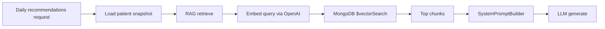

# RAG Search Implementation Analysis

RAG in this project is a **backend-only retrieval layer** used when generating daily recommendations. It is not exposed as a standalone search API on the frontend.

## High-level flow



1. Load the patient snapshot (profile + vitals).
2. Optionally retrieve RAG chunks for that user.
3. Build system + user prompts with those chunks.
4. Call the LLM and parse JSON recommendations.

## Core retrieval (`RagService`)

The implementation lives in `backend/src/rag/rag.service.ts` and uses **MongoDB Atlas Vector Search**.

Key details:

- **Query embedding**: OpenAI `text-embedding-3-small` (1536 dimensions) via `OpenAIEmbeddingService`.
- **Default query**: If none is passed, it uses `"general health context"`.
- **Vector index**: Atlas index named `vector_index` on `documentchunks.embedding`.
- **Scoping**: Results are filtered by `userId`; optionally by `specialty`.
- **Options**: `limit` (default 5), `minScore`, `specialty`.
- **Failure mode**: Embedding or search errors return `[]`; recommendations still proceed without RAG.

Relevant code:

```typescript
// backend/src/rag/rag.service.ts
async retrieve(userId: string, query?: string, options?: RagRetrieveOptions): Promise<RagChunk[]> {
  const limit = options?.limit ?? 5;
  const searchText = (query?.trim()?.length ? query : 'general health context').trim();
  embedding = await this.embeddingService.embed(searchText);

  const filter = { userId: new Types.ObjectId(userId) };
  // optional specialty filter

  const pipeline = [
    {
      $vectorSearch: {
        index: 'vector_index',
        path: 'embedding',
        queryVector: embedding,
        numCandidates: Math.max(limit * 10, 100),
        limit,
        filter,
      },
    },
    {
      $project: {
        content: 1,
        source: 1,
        score: { $meta: 'vectorSearchScore' },
      },
    },
  ];
}
```

## Stored data model

Chunks live in the `documentchunks` collection (`backend/src/rag/schemas/document-chunk.schema.ts`):

| Field | Purpose |
|-------|---------|
| `content` | Text chunk |
| `embedding` | Vector (1536 dims for OpenAI) |
| `source` | Document name or identifier |
| `sourceType` | e.g. `user-doc`, `guideline`, `specialty` |
| `documentType` | For user docs: `blood_analysis`, `medical_report`, etc. |
| `specialty` | Optional filter: `cardiology`, `nutrition`, etc. |
| `userId` | Owner of user-specific documents |
| `documentId` | Reference to `userdocuments` |
| `chunkIndex` | Position within source document |

Two intended source types (from the seed script and docs):

- **User docs** (`sourceType: 'user-doc'`) — lab results, reports, prescriptions, tied to a `userId`.
- **Knowledge base** (`sourceType: 'guideline'`, `'specialty'`) — general medical guidelines.

## How it feeds the LLM

`RecommendationsService` calls RAG during recommendation generation (`backend/src/recommendations/recommendations.service.ts`):

```typescript
let ragChunks: RagChunk[] = [];
if (includeRag) {
  ragChunks = await this.retrieveRagContext(userId, ragQuery);
}
const { system, prompt: basePrompt } = this.promptBuilder.build(snapshot, ragChunks);
```

`SystemPromptBuilder` injects chunks into the **user prompt** under an "ADDITIONAL CONTEXT" header (`backend/src/llm/prompts/system-prompt.builder.ts`):

```
ADDITIONAL CONTEXT (from medical knowledge base):
[1] (source: lab_results_jan2025.pdf)
Complete blood count and metabolic panel...

[2] (source: Nutrition guidelines v1)
Nutrition guidelines for blood sugar management...
```

The API controller currently always calls with defaults (`includeRag: true`, no custom `ragQuery`) — those options exist on the service but are not exposed via HTTP yet.

## Module wiring

- `RagModule` (`backend/src/rag/rag.module.ts`) registers:
  - `OpenAIEmbeddingService` via `EMBEDDING_SERVICE` token
  - `RagService` via `RAG_SERVICE` token
- `RecommendationsModule` imports `RagModule` and injects `RAG_SERVICE`.

## Indexing / seeding (not live ingestion)

There is **no production PDF ingestion pipeline** yet. Data is seeded via `backend/scripts/seed-rag-data.ts`, which:

- Creates `userdocuments` + `documentchunks` for `jane@example.com`.
- Uses **fake placeholder embeddings** (deterministic sine waves), not real OpenAI embeddings — so seeded results are structurally correct but not semantically meaningful until real embeddings are stored.

Run with: `npm run seed:rag` (from `backend/`).

## What's not implemented yet

Per `docs/rag_implementation_plan.md`:

- Real PDF upload → chunk → embed → store pipeline
- Document type classification and structured extraction at ingest time
- Exposing `ragQuery` / `includeRag` on the recommendations API

## Known quirk

The seed script creates knowledge-base chunks **without** a `userId`, but retrieval always filters by `userId`. Those global guideline chunks won't be returned for any user until that filter logic is adjusted (e.g. allow chunks with no `userId` or use a separate knowledge-base filter).

## Related files

| File | Role |
|------|------|
| `backend/src/rag/rag.service.ts` | Vector search retrieval |
| `backend/src/rag/rag.interface.ts` | `IRagService`, `RagChunk` types |
| `backend/src/rag/rag.module.ts` | NestJS module wiring |
| `backend/src/rag/embedding/openai-embedding.service.ts` | OpenAI embeddings |
| `backend/src/rag/schemas/document-chunk.schema.ts` | MongoDB schema |
| `backend/src/recommendations/recommendations.service.ts` | RAG consumer |
| `backend/src/llm/prompts/system-prompt.builder.ts` | Prompt injection |
| `backend/scripts/seed-rag-data.ts` | Dev seed data |
| `docs/rag_implementation_plan.md` | Planned full implementation |
