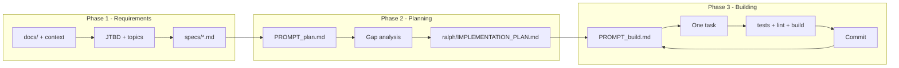

# Ralph Wiggum Loop in MedicalAgent

A plan for integrating the Ralph Wiggum autonomous loop into the MedicalAgent repo: specs-driven workflow (Phase 1: requirements as JTBD specs, Phase 2: planning via gap analysis, Phase 3: building one task per loop), with concrete examples and a clear definition of "done" via backpressure and optional acceptance-driven tests.

---

## Current state

- **Repo layout**: Monorepo with [backend/](../backend/) (NestJS + Fastify) and [frontend/](../frontend/) (Next.js). No root `package.json`; each app has its own scripts.
- **Docs**: [docs/](.) already holds project context, AI agent design, frontend structure, and data model—suitable as input for Phase 1 and for steering.
- **Validation**: Backend: `npm run build`, `npm run test`, `npm run lint`. Frontend: `npm run build`, `npm run lint`. No single root script; loop will run both.

Ralph will live at **repository root**: one loop, one plan, one `specs/` folder; the agent works across both backend and frontend.

---

## 1. File layout to add

Create at repo root:

```
MedicalAgent/
├── ralph/
│   ├── loop.sh                  # Outer loop: feed prompt to agent, optional max iterations
│   ├── PROMPT_plan.md           # Planning mode: gap analysis → IMPLEMENTATION_PLAN.md
│   ├── PROMPT_build.md          # Building mode: one task from plan, implement, validate, commit
│   ├── AGENTS.md                # How to build/run/test backend and frontend (operational only)
│   ├── IMPLEMENTATION_PLAN.md   # Current plan (generated/updated by Ralph)
│   └── implementation-history/ # Archived plans with timestamps (e.g. IMPLEMENTATION_PLAN_2026-03-04.md)
├── specs/                       # One .md per topic of concern (source of truth)
│   ├── daily-recommendations-api.md
│   ├── daily-recommendations-ui.md
│   └── ...
└── (existing backend/ frontend/ docs/)
```

Keep the current plan at `ralph/IMPLEMENTATION_PLAN.md`; archive older plans in `ralph/implementation-history/` with readable timestamps (e.g. `IMPLEMENTATION_PLAN_2026-03-04.md`). `ralph/` holds the loop, prompts, plan, and AGENTS.md; prompts point to `ralph/IMPLEMENTATION_PLAN.md`.

**Where things live:**

| Item | Location | Reason |
|------|----------|--------|
| **Specs** | **Project root** (`specs/`) | Single source of truth for requirements; shared by plan and build agents; visible to humans and tooling at repo root. Do not move specs into `ralph/`. |
| **Current implementation plan** | `ralph/IMPLEMENTATION_PLAN.md` | Ralph-owned artifact; plan and build prompts read/write it. |
| **Plan history** | `ralph/implementation-history/` | Archived snapshots with timestamps; read-only. |

---

## 2. Phase 1 – Define requirements (examples)

**Goal**: Turn project ideas and existing docs into **Jobs to Be Done (JTBD)** and then into **one spec per topic of concern**. Topic scope: describable in one sentence without "and" (e.g. "The recommendations UI displays daily recommendations and allows filtering by category" is one topic; "auth and profile and billing" would be three).

**Inputs**: [project_context.md](project_context.md), [ai_agent.md](ai_agent.md), [frontend_structure.md](frontend_structure.md), [data_model.md](data_model.md). Optionally URLs or internal design notes.

**Output**: `specs/<topic>.md` files. Each spec should include:

- Purpose and scope (one topic)
- Acceptance criteria (observable outcomes; what "done" looks like)
- Out-of-scope or constraints if relevant

**Example JTBD and topics**

| JTBD                            | Topics of concern                                                                      | Spec file                                                                                         |
| ------------------------------- | -------------------------------------------------------------------------------------- | ------------------------------------------------------------------------------------------------- |
| User sees daily recommendations | API for daily recommendations, UI for recommendations page, error and loading behavior | `daily-recommendations-api.md`, `daily-recommendations-ui.md`, `recommendations-error-loading.md` |

**Example spec (snippet) – `specs/daily-recommendations-ui.md`**

```markdown
# Daily recommendations UI

## Purpose
The recommendations page shows the user's daily recommendations (nutrition, exercise, lifestyle, alerts) and related vitals charts. User can switch chart period and refetch by category.

## Scope
- Route: `/recommendations` (or per nav-config).
- Data: Daily recommendations from API; vitals for charts (e.g. last 7/15/30 days).
- UI: Summary, category-wise blocks, charts with period selector, loading and error states.

## Acceptance criteria
- When recommendations are loading, a loading indicator is shown (no blank content).
- When the user changes chart period (7/15/30 days), chart data updates and a loading state is shown until new data is loaded.
- When an error occurs (e.g. API failure), an error message is shown and the user can retry.
- Recommendations are displayed in the four categories; each category shows at least a heading and list of items or empty state.
```

Ralph does not run in a loop for Phase 1; it's a **conversation** (or a single long session): human + LLM define JTBD, split topics, then the LLM writes each `specs/*.md`. Subagents can load `docs/*` and URLs into context before writing specs.

---

## 3. Phase 2 – Planning (gap analysis; example)

**Goal**: No implementation. Produce or update **ralph/IMPLEMENTATION_PLAN.md** by comparing `specs/*` to current code in `backend/src` and `frontend/src`.

**Mechanics**: Run the loop in **planning mode**: prompt = `PROMPT_plan.md`. Each iteration: agent studies `specs/*`, studies existing code (and `ralph/IMPLEMENTATION_PLAN.md` if present), performs gap analysis, writes/updates `ralph/IMPLEMENTATION_PLAN.md` with a **prioritized bullet list of tasks**. No commits, no code changes.

**Example `PROMPT_plan.md` (conceptual)**

- 0a. Study `specs/*` to learn requirements.
- 0b. Study `ralph/IMPLEMENTATION_PLAN.md` if present.
- 0c. Study `backend/src` and `frontend/src` (and shared libs).
- 1. Compare specs to code; create/update `ralph/IMPLEMENTATION_PLAN.md` with prioritized tasks. Plan only; do not implement.
- Important: Do not assume something is missing; search codebase first. Treat `frontend/src/lib` and `backend/src/common` as shared utilities.

**Example output – `ralph/IMPLEMENTATION_PLAN.md` (excerpt)**

```markdown
# Implementation plan (generated/updated by Ralph)

- [ ] Recommendations page: add loading state when chart period changes (spec: daily-recommendations-ui – "loading state when chart period changes").
- [ ] Recommendations page: ensure error state shows retry action (spec: recommendations-error-loading).
- [ ] Backend: add unit test for recommendations when RAG returns empty (spec: daily-recommendations-api).
- [ ] Frontend: add E2E or component test for recommendations loading/error (optional; acceptance-driven).
- [x] GET /recommendations/daily returns 200 and structured body (done).
```

Planned tasks should be **one unit of work per loop** (small enough for one context window). "Done" items can be kept briefly for context, then pruned to avoid clutter (per playbook).

---

## 4. Phase 3 – Building (one task per loop; example)

**Goal**: Implement one task from `ralph/IMPLEMENTATION_PLAN.md`, validate with backpressure, update plan and commit. Loop provides fresh context each time.

**Mechanics**: Run the loop in **building mode**: prompt = `PROMPT_build.md`. Each iteration:

- Read `ralph/IMPLEMENTATION_PLAN.md` and pick the **most important** task.
- Search codebase first ("don't assume not implemented").
- Implement (using subagents if the agent supports them).
- Run **backpressure** (see below).
- Update `ralph/IMPLEMENTATION_PLAN.md` (mark done, add discoveries).
- Commit (and optionally push). Then exit; loop restarts with fresh context.

**Example `PROMPT_build.md` (conceptual)**

- 0a. Study `specs/*`. 0b. Study `ralph/IMPLEMENTATION_PLAN.md`. 0c. Source: `backend/src`, `frontend/src`.
- 1. Implement one task from the plan (most important). Search before assuming missing.
- 2. Run tests/lint/build per `AGENTS.md`.
- 3. On issues, update plan with findings.
- 4. When green: update plan, `git add -A`, `git commit`, then exit.
- 999… Guardrails: single sources of truth; keep `ralph/IMPLEMENTATION_PLAN.md` and `ralph/AGENTS.md` updated; no placeholders.

**Example task execution**

- Task: "Recommendations page: add loading state when chart period changes."
- Agent opens `frontend/src/app/(app)/recommendations/page.tsx`, sees `chartPeriod` state and `getVitalsByPeriod`; adds a local loading state for "chart period changing", sets it around the refetch, shows spinner in chart area; runs `cd frontend && npm run lint && npm run build`; then `cd backend && npm run test`. Updates `ralph/IMPLEMENTATION_PLAN.md` (mark task done), commits with message like "feat(recommendations): loading state when chart period changes".

---

## 5. Backpressure and "done"

**Backpressure** = automated checks that must pass before the agent commits. They are the primary definition of "done" for a task.

**AGENTS.md (operational only)** – Example content:

```markdown
# How to build and validate

## Backend (backend/)
- Build: npm run build
- Unit tests: npm run test
- Lint: npm run lint

## Frontend (frontend/)
- Build: npm run build
- Lint: npm run lint

## Full validation (from repo root)
- Backend: cd backend && npm run lint && npm run test && npm run build
- Frontend: cd frontend && npm run lint && npm run build
```

Ralph runs these (or the "Full validation" pair) after each implementation step. **Feature is accepted as done when**:

1. The task is implemented per spec intent.
2. Backpressure passes (lint + test + build for the affected app(s)).
3. `ralph/IMPLEMENTATION_PLAN.md` is updated and the change is committed.

**Optional – Acceptance-driven "done"**: In each spec, write acceptance criteria (e.g. "When chart period changes, loading indicator is shown"). In planning, derive **test requirements** (e.g. "Recommendations page: test that changing period shows loading"). In building, Ralph (or you) adds or updates tests so those requirements pass. Then "done" = backpressure passes **and** acceptance-derived tests pass. This avoids "seems done" without proof.

---

## 6. Loop script and agent choice

**Implementation: Cursor CLI (`cursor-agent`)**

We're using **Cursor's CLI** (`cursor-agent`) for this project, which provides programmatic agent invocation similar to Claude CLI but integrated with Cursor's capabilities.

**loop.sh** (in `ralph/`):

- Parse argument: `plan` vs build; optional `max_iterations`.
- Loop: `cat PROMPT_plan.md` or `cat PROMPT_build.md` | `cursor-agent --print --mode agent`
- After each run: optionally `git push`; increment iteration; stop if `max_iterations` reached.

**Cursor CLI setup:**

1. Install Cursor CLI: `curl https://cursor.com/install -fsS | bash`
2. Authenticate: Set `CURSOR_API_KEY` environment variable or use `--api-key` flag
3. CLI flags for automation:
   - `--print` or `-p`: Non-interactive mode (required for scripts)
   - `--mode agent`: Use agent mode (can also use `plan` or `ask`)
   - `--output-format stream-json`: Structured output for monitoring/logging
   - `--force`: Allow file modifications without confirmation (similar to `--dangerously-skip-permissions`)

**Example loop.sh snippet:**

```bash
cat "$PROMPT_FILE" | cursor-agent --print \
  --mode agent \
  --output-format stream-json \
  --force
```

The agent runs **non-interactively** (headless) with full access to tools including file writing and bash commands (so it can execute npm scripts). No code changes needed in backend/frontend for the loop itself.

---

## 6.1. Alternative implementations (for future analysis)

While we're using **Cursor CLI** for this project, here are alternative implementations that could be considered:

### Option 1: Claude CLI (Original Ralph)

**What it is**: Geoffrey Huntley's original implementation uses Claude CLI (`claude` command).

**Pros**:
- Battle-tested by the creator
- Direct access to Claude models
- `--dangerously-skip-permissions` flag for full automation
- Well-documented in the Ralph playbook

**Cons**:
- Requires separate Claude CLI installation
- Not integrated with Cursor IDE
- May require separate API key management

**Implementation**:
```bash
cat "$PROMPT_FILE" | claude -p --dangerously-skip-permissions
```

**When to consider**: If you want the exact original Ralph implementation or prefer Claude models directly.

---

### Option 2: Cursor Agent (Current Choice)

**What it is**: Cursor's CLI (`cursor-agent`) for programmatic agent invocation.

**Pros**:
- Integrated with Cursor IDE ecosystem
- Uses Cursor's agent capabilities
- Supports structured output (`--output-format stream-json`)
- Can leverage Cursor's context and tooling

**Cons**:
- Requires Cursor CLI installation
- May have different behavior than Claude CLI
- Less documented than original Ralph

**Implementation**:
```bash
cat "$PROMPT_FILE" | cursor-agent --print --mode agent --force
```

**When to consider**: When you're already using Cursor IDE and want integration with its tooling.

---

### Option 3: Hybrid/Manual Approach

**What it is**: Keep the loop structure and prompts, but run each iteration manually in Cursor IDE.

**Pros**:
- Full control over each iteration
- Can review and approve before proceeding
- No CLI setup required
- Works with any Cursor IDE user

**Cons**:
- Not fully autonomous (requires human trigger)
- Slower iteration cycle
- Loses the "let Ralph Ralph" benefit
- More prone to interruption

**Implementation**:
1. Open `PROMPT_plan.md` or `PROMPT_build.md` in Cursor
2. Manually trigger agent with the prompt content
3. Review output, commit if satisfied
4. Repeat for next iteration

**When to consider**: For learning Ralph patterns, debugging issues, or when you want maximum control.

---

### Option 4: Custom Wrapper Script

**What it is**: Create a Node.js/Python script that wraps Cursor API or uses Cursor CLI programmatically.

**Pros**:
- Full customization of loop behavior
- Can add custom logging, monitoring, or error handling
- Can integrate with other tools (CI/CD, monitoring, etc.)
- Can implement custom retry logic or safeguards

**Cons**:
- Requires development effort
- Must maintain custom code
- May break if Cursor API changes
- More complex than simple bash loop

**Implementation example** (Node.js):
```javascript
const { exec } = require('child_process');
const fs = require('fs');

async function runRalphIteration(mode, maxIterations) {
  const promptFile = mode === 'plan' ? 'PROMPT_plan.md' : 'PROMPT_build.md';
  const prompt = fs.readFileSync(`ralph/${promptFile}`, 'utf8');
  
  // Custom logic: logging, error handling, etc.
  return new Promise((resolve, reject) => {
    const proc = exec(`echo "${prompt}" | cursor-agent --print --mode agent`, 
      (error, stdout, stderr) => {
        if (error) reject(error);
        else resolve(stdout);
      }
    );
  });
}
```

**When to consider**: When you need custom behavior, integration with other systems, or advanced error handling.

---

### Comparison Matrix

| Option | Autonomy | Setup Complexity | Integration | Customization |
|-------|----------|------------------|-------------|---------------|
| Claude CLI | Full | Medium | Low | Low |
| Cursor CLI | Full | Low | High | Medium |
| Hybrid/Manual | None | None | High | High |
| Custom Wrapper | Full | High | Medium | Very High |

**Recommendation**: Start with **Cursor CLI** (current choice) for autonomous operation with good Cursor integration. Consider **Hybrid/Manual** for learning or debugging, and **Custom Wrapper** if you need advanced features.

---

## 7. Summary diagram



---

## 8. Suggested next steps (after approval)

1. Add `ralph/` with `loop.sh`, `PROMPT_plan.md`, `PROMPT_build.md`, and `AGENTS.md` (with the repo's real commands).
2. Add `specs/` and seed 2–3 example specs (e.g. daily-recommendations-ui, daily-recommendations-api) derived from [ai_agent.md](ai_agent.md) and [frontend_structure.md](frontend_structure.md).
3. Add initial `ralph/IMPLEMENTATION_PLAN.md` (can be empty or a first planning run). Use `ralph/implementation-history/` for archived plans.
4. Document in docs how to run Phase 1 (conversation), Phase 2 (`./ralph/loop.sh plan`), Phase 3 (`./ralph/loop.sh build`), and how "done" is defined (backpressure + optional acceptance-driven tests).

This keeps Ralph aligned with the creator's intent: one loop, two prompts (plan vs build), specs as source of truth, backpressure for acceptance, and you "sit on the loop" (tune prompts and AGENTS.md) rather than doing the tasks yourself.
