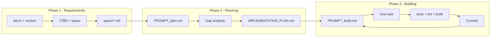

# Ralph Wiggum Loop in MedicalAgent

A plan for integrating the Ralph Wiggum autonomous loop into the MedicalAgent repo: specs-driven workflow (Phase 1: requirements as JTBD specs, Phase 2: planning via gap analysis, Phase 3: building one task per loop), with concrete examples and a clear definition of "done" via backpressure and optional acceptance-driven tests.

---

## Current state

- **Repo layout**: Monorepo with [backend/](../backend/) (NestJS + Fastify) and [frontend/](../frontend/) (Next.js). No root `package.json`; each app has its own scripts.
- **Docs**: [docs/](.) already holds project context, AI agent design, frontend structure, and data model—suitable as input for Phase 1 and for steering.
- **Validation**: Backend: `npm run build`, `npm run test`, `npm run lint`. Frontend: `npm run build`, `npm run lint`. No single root script; loop will run both.

Ralph will live at **repository root**: one loop, one plan, one `specs/` folder; the agent works across both backend and frontend.

---

## 1. File layout to add

Create at repo root:

```
MedicalAgent/
├── ralph/
│   ├── loop.sh              # Outer loop: feed prompt to agent, optional max iterations
│   ├── PROMPT_plan.md       # Planning mode: gap analysis → IMPLEMENTATION_PLAN.md
│   ├── PROMPT_build.md      # Building mode: one task from plan, implement, validate, commit
│   └── AGENTS.md            # How to build/run/test backend and frontend (operational only)
├── specs/                   # One .md per topic of concern (source of truth)
│   ├── daily-recommendations-api.md
│   ├── daily-recommendations-ui.md
│   └── ...
├── IMPLEMENTATION_PLAN.md   # Generated/updated by Ralph (prioritized task list)
└── (existing backend/ frontend/ docs/)
```

Keep `IMPLEMENTATION_PLAN.md` at root so the agent and humans see one canonical plan. `ralph/` holds only the loop and prompts; `AGENTS.md` can live in `ralph/` and be referenced as `ralph/AGENTS.md` in prompts, or at root—either way, prompts must point to a single path.

---

## 2. Phase 1 – Define requirements (examples)

**Goal**: Turn project ideas and existing docs into **Jobs to Be Done (JTBD)** and then into **one spec per topic of concern**. Topic scope: describable in one sentence without "and" (e.g. "The recommendations UI displays daily recommendations and allows filtering by category" is one topic; "auth and profile and billing" would be three).

**Inputs**: [project_context.md](project_context.md), [ai_agent.md](ai_agent.md), [frontend_structure.md](frontend_structure.md), [data_model.md](data_model.md). Optionally URLs or internal design notes.

**Output**: `specs/<topic>.md` files. Each spec should include:

- Purpose and scope (one topic)
- Acceptance criteria (observable outcomes; what "done" looks like)
- Out-of-scope or constraints if relevant

**Example JTBD and topics**

| JTBD                            | Topics of concern                                                                      | Spec file                                                                                         |
| ------------------------------- | -------------------------------------------------------------------------------------- | ------------------------------------------------------------------------------------------------- |
| User sees daily recommendations | API for daily recommendations, UI for recommendations page, error and loading behavior | `daily-recommendations-api.md`, `daily-recommendations-ui.md`, `recommendations-error-loading.md` |

**Example spec (snippet) – `specs/daily-recommendations-ui.md`**

```markdown
# Daily recommendations UI

## Purpose
The recommendations page shows the user's daily recommendations (nutrition, exercise, lifestyle, alerts) and related vitals charts. User can switch chart period and refetch by category.

## Scope
- Route: `/recommendations` (or per nav-config).
- Data: Daily recommendations from API; vitals for charts (e.g. last 7/15/30 days).
- UI: Summary, category-wise blocks, charts with period selector, loading and error states.

## Acceptance criteria
- When recommendations are loading, a loading indicator is shown (no blank content).
- When the user changes chart period (7/15/30 days), chart data updates and a loading state is shown until new data is loaded.
- When an error occurs (e.g. API failure), an error message is shown and the user can retry.
- Recommendations are displayed in the four categories; each category shows at least a heading and list of items or empty state.
```

Ralph does not run in a loop for Phase 1; it's a **conversation** (or a single long session): human + LLM define JTBD, split topics, then the LLM writes each `specs/*.md`. Subagents can load `docs/*` and URLs into context before writing specs.

---

## 3. Phase 2 – Planning (gap analysis; example)

**Goal**: No implementation. Produce or update **IMPLEMENTATION_PLAN.md** by comparing `specs/*` to current code in `backend/src` and `frontend/src`.

**Mechanics**: Run the loop in **planning mode**: prompt = `PROMPT_plan.md`. Each iteration: agent studies `specs/*`, studies existing code (and `IMPLEMENTATION_PLAN.md` if present), performs gap analysis, writes/updates `IMPLEMENTATION_PLAN.md` with a **prioritized bullet list of tasks**. No commits, no code changes.

**Example `PROMPT_plan.md` (conceptual)**

- 0a. Study `specs/*` to learn requirements.
- 0b. Study `IMPLEMENTATION_PLAN.md` if present.
- 0c. Study `backend/src` and `frontend/src` (and shared libs).
- 1. Compare specs to code; create/update `IMPLEMENTATION_PLAN.md` with prioritized tasks. Plan only; do not implement.
- Important: Do not assume something is missing; search codebase first. Treat `frontend/src/lib` and `backend/src/common` as shared utilities.

**Example output – `IMPLEMENTATION_PLAN.md` (excerpt)**

```markdown
# Implementation plan (generated/updated by Ralph)

- [ ] Recommendations page: add loading state when chart period changes (spec: daily-recommendations-ui – "loading state when chart period changes").
- [ ] Recommendations page: ensure error state shows retry action (spec: recommendations-error-loading).
- [ ] Backend: add unit test for recommendations when RAG returns empty (spec: daily-recommendations-api).
- [ ] Frontend: add E2E or component test for recommendations loading/error (optional; acceptance-driven).
- [x] GET /recommendations/daily returns 200 and structured body (done).
```

Planned tasks should be **one unit of work per loop** (small enough for one context window). "Done" items can be kept briefly for context, then pruned to avoid clutter (per playbook).

---

## 4. Phase 3 – Building (one task per loop; example)

**Goal**: Implement one task from `IMPLEMENTATION_PLAN.md`, validate with backpressure, update plan and commit. Loop provides fresh context each time.

**Mechanics**: Run the loop in **building mode**: prompt = `PROMPT_build.md`. Each iteration:

- Read `IMPLEMENTATION_PLAN.md` and pick the **most important** task.
- Search codebase first ("don't assume not implemented").
- Implement (using subagents if the agent supports them).
- Run **backpressure** (see below).
- Update `IMPLEMENTATION_PLAN.md` (mark done, add discoveries).
- Commit (and optionally push). Then exit; loop restarts with fresh context.

**Example `PROMPT_build.md` (conceptual)**

- 0a. Study `specs/*`. 0b. Study `IMPLEMENTATION_PLAN.md`. 0c. Source: `backend/src`, `frontend/src`.
- 1. Implement one task from the plan (most important). Search before assuming missing.
- 2. Run tests/lint/build per `AGENTS.md`.
- 3. On issues, update plan with findings.
- 4. When green: update plan, `git add -A`, `git commit`, then exit.
- 999… Guardrails: single sources of truth; keep `IMPLEMENTATION_PLAN.md` and `AGENTS.md` updated; no placeholders.

**Example task execution**

- Task: "Recommendations page: add loading state when chart period changes."
- Agent opens `frontend/src/app/(app)/recommendations/page.tsx`, sees `chartPeriod` state and `getVitalsByPeriod`; adds a local loading state for "chart period changing", sets it around the refetch, shows spinner in chart area; runs `cd frontend && npm run lint && npm run build`; then `cd backend && npm run test`. Updates `IMPLEMENTATION_PLAN.md` (mark task done), commits with message like "feat(recommendations): loading state when chart period changes".

---

## 5. Backpressure and "done"

**Backpressure** = automated checks that must pass before the agent commits. They are the primary definition of "done" for a task.

**AGENTS.md (operational only)** – Example content:

```markdown
# How to build and validate

## Backend (backend/)
- Build: npm run build
- Unit tests: npm run test
- Lint: npm run lint

## Frontend (frontend/)
- Build: npm run build
- Lint: npm run lint

## Full validation (from repo root)
- Backend: cd backend && npm run lint && npm run test && npm run build
- Frontend: cd frontend && npm run lint && npm run build
```

Ralph runs these (or the "Full validation" pair) after each implementation step. **Feature is accepted as done when**:

1. The task is implemented per spec intent.
2. Backpressure passes (lint + test + build for the affected app(s)).
3. `IMPLEMENTATION_PLAN.md` is updated and the change is committed.

**Optional – Acceptance-driven "done"**: In each spec, write acceptance criteria (e.g. "When chart period changes, loading indicator is shown"). In planning, derive **test requirements** (e.g. "Recommendations page: test that changing period shows loading"). In building, Ralph (or you) adds or updates tests so those requirements pass. Then "done" = backpressure passes **and** acceptance-derived tests pass. This avoids "seems done" without proof.

---

## 6. Loop script and agent choice

**loop.sh** (in `ralph/`):

- Parse argument: `plan` vs build; optional `max_iterations`.
- Loop: `cat PROMPT_plan.md` or `cat PROMPT_build.md` into the agent (e.g. `claude -p --dangerously-skip-permissions` for Claude CLI), or equivalent for Cursor/other CLI.
- After each run: optionally `git push`; increment iteration; stop if `max_iterations` reached.

Agent must run **non-interactively** (headless), with permission to run shell commands (so it can execute npm scripts). If using Cursor, the loop can be "run Cursor agent with this prompt file" instead of piping to `claude`. No code changes needed in backend/frontend for the loop itself.

---

## 7. Summary diagram



---

## 8. Suggested next steps (after approval)

1. Add `ralph/` with `loop.sh`, `PROMPT_plan.md`, `PROMPT_build.md`, and `AGENTS.md` (with the repo's real commands).
2. Add `specs/` and seed 2–3 example specs (e.g. daily-recommendations-ui, daily-recommendations-api) derived from [ai_agent.md](ai_agent.md) and [frontend_structure.md](frontend_structure.md).
3. Add initial `IMPLEMENTATION_PLAN.md` (can be empty or a first planning run).
4. Document in docs how to run Phase 1 (conversation), Phase 2 (`./ralph/loop.sh plan`), Phase 3 (`./ralph/loop.sh build`), and how "done" is defined (backpressure + optional acceptance-driven tests).

This keeps Ralph aligned with the creator's intent: one loop, two prompts (plan vs build), specs as source of truth, backpressure for acceptance, and you "sit on the loop" (tune prompts and AGENTS.md) rather than doing the tasks yourself.
